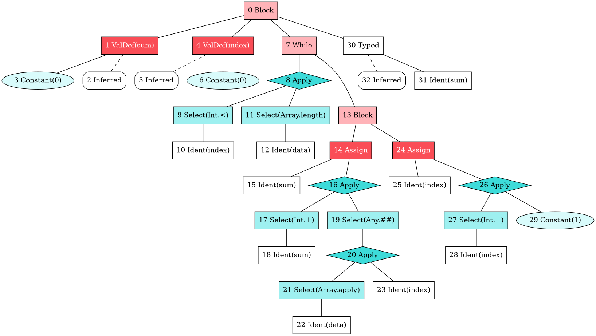

# Visualizing Scala 3 TASTy Interchange Format

`amaranth` converts Scala's `.tasty` tree format into a `.dot` graph format. This project is very work-in-progress and 
features are implemented on a need-to-use basis.

## Installation and Usage

```shell
> sbt assembly

> ./amaranth --help
amaranth 0.1
Usage: amaranth [options] <file>.tasty ...

  --help            prints this usage text
  -o, --out <file>  output directory
  <file>.tasty ...  required .tasty files

```

## Example 

For the following function

```scala
def checksum[T](data: Array[T]): Int = {
  var sum = 0
  var index = 0
  while (index < data.length) {
    sum += data(index).##
    index += 1
  }
  sum
}
```

`amaranth` will generate the following `.dot` graph 


